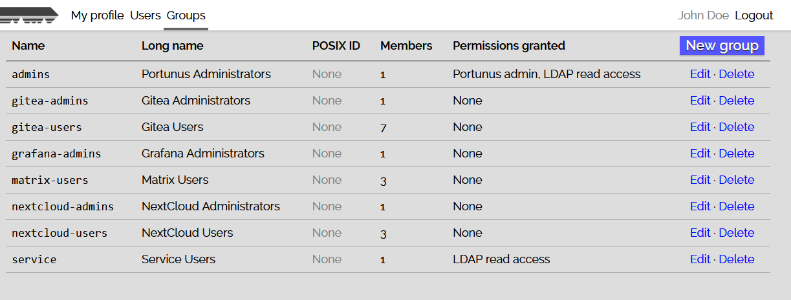

Portunus was the ancient Roman god of keys and doors. However, this repo does not
contain the god. It contains Portunus, a small and self-contained user/group
management and authentication service.

In this document:

* [Overview](#overview)
* [Running](#running)
  * [HTTP access](#http-access)
  * [LDAP directory structure](#ldap-directory-structure)
* [Connecting services to Portunus](#connecting-services-to-portunus)
  * [Single-bind authentication](#single-bind-authentication)
  * [Double-bind authentication](#double-bind-authentication)
* [Seeding users and groups from static configuration](#seeding-users-and-groups-from-static-configuration)

## Overview

Portunus is aimed at individuals and small organizations that want to manage users and permissions
across different services, and don't want to deal with the minutiae of LDAP administration. This
product includes:

- a simple and clean web GUI for managing user accounts and group memberships (no JavaScript
  required!),
- a fully-functional OpenLDAP server that services can use to authenticate users.
- SAML or OAuth support will be added as soon as someone writes the code.

The OpenLDAP server is completely managed by Portunus. No LDAP experience is required to run
Portunus beyond what this README explains.

<details>
<summary>Screenshots</summary>




</details>

## Building

Build with `make && sudo make install` in the usual way. Our build dependencies are:

- a Go compiler (see `go.mod` for minimum version requirement)
- a libcrypt.so that is [libxcrypt](github.com/besser82/libxcrypt)

If for some reason you absolutely do not have any access to `make`, The individual binaries can also be installed with
`go install github.com/majewsky/portunus/cmd/portunus-{orchestrator,server}`.

## Running

Once installed, run `portunus-orchestrator` with root privileges. Config is passed to it via the
following environment variables:

| Variable | Default | Explanation |
| -------- | ------- | ----------- |
| `PORTUNUS_DEBUG` | `false` | When true, log debug messages to standard error. May cause passwords to be logged. **Do not use in production.** |
| `PORTUNUS_GROUP_NAME_REGEX` | `^[a-z_][a-z0-9_-]*\$?$` | Names of groups will be rejected as invalid unless they match this regular expression, given in [Go regex syntax](https://pkg.go.dev/regexp/syntax). The default is the same as for POSIX account names. Even if this regex is set to be more liberal than the default, groups that are POSIX groups must also conform to the POSIX account name regex. |
| `PORTUNUS_LDAP_SUFFIX` | *(required)* | The DN of the topmost entry in your LDAP directory. Must currently be a sequence of `dc=xxx` RDNs. (This requirement may be lifted in future versions.) See [*LDAP directory structure*](#ldap-directory-structure) for details and a guide-level explanation. |
| `PORTUNUS_SEED_PATH` | *(optional)* | If given, seed users and groups from the configuration file at the given path. This is the recommended setup method when using configuration management. [See below](#seeding-users-and-groups-from-static-configuration) for details. |
| `PORTUNUS_SERVER_BINARY` | `portunus-server` | Where to find the portunus-server binary. Semantics match those of `execvp(3)`: If the supplied value is not a path containing slashes, `$PATH` will be searched for it. |
| `PORTUNUS_SERVER_GROUP`<br>`PORTUNUS_SERVER_USER` | `portunus` each | The Unix user/group that Portunus' own server will be run as. |
| `PORTUNUS_SERVER_HTTP_LISTEN` | `127.0.0.1:8080` | Listen address where Portunus' HTTP server shall be running. |
| `PORTUNUS_SERVER_HTTP_SECURE` | `true` | **Do not unset this flag in productive deployments.** In test deployments, this can be set to `false` so that the web GUI works without TLS. |
| `PORTUNUS_SERVER_STATE_DIR` | `/var/lib/portunus` | The path where Portunus stores its database. **Set up a backup for this directory.** |
| `PORTUNUS_SLAPD_BINARY` | `slapd` | Where to find the binary of slapd (the OpenLDAP server). Semantics match those of `execvp(3)`: If the supplied value is not a path containing slashes, `$PATH` will be searched for it. The slapd binary must link against the same libcrypt as the Portunus binaries, otherwise there will be disagreement between both parties on how password hashes work. |
| `PORTUNUS_SLAPD_GROUP`<br>`PORTUNUS_SLAPD_USER` | `ldap` each | The Unix user/group that slapd will be run as. |
| `PORTUNUS_SLAPD_SCHEMA_DIR` | `/etc/openldap/schema` | Where to find OpenLDAP's schema definitions. |
| `PORTUNUS_SLAPD_STATE_DIR` | `/var/run/portunus-slapd` | The path where slapd stores its database. The contents of this directory are ephemeral and will be wiped when Portunus restarts, so you do not need to back this up. Place this on a tmpfs for optimal performance. |
| `PORTUNUS_SLAPD_TLS_CERTIFICATE` | *(optional)* | **Recommended for productive deployments.** The path to the TLS certificate of the LDAP server. When given, LDAPS (on port 636) is served instead of LDAP (on port 389). |
| `PORTUNUS_SLAPD_TLS_CA_CERTIFICATE` | *(optional)* | *Required* when a TLS certificate is given. The full chain of CA certificates which has signed the TLS certificate, *including the root CA*. |
| `PORTUNUS_SLAPD_TLS_DOMAIN_NAME` | *(optional)* | *Required* when a TLS certificate is given. The domain name for which the certificate is valid. `portunus-server` will use this domain name when connecting to the LDAP server. |
| `PORTUNUS_SLAPD_TLS_PRIVATE_KEY` | *(optional)* | *Required* when a TLS certificate is given. The path to the private key belonging to the TLS certificate. |
| `PORTUNUS_USER_NAME_REGEX` | `^[a-z_][a-z0-9_-]*\$?$` | Login names of users will be rejected as invalid unless they match this regular expression, given in [Go regex syntax](https://pkg.go.dev/regexp/syntax). The default is the same as for POSIX account names. Even if this regex is set to be more liberal than the default, user accounts that are POSIX users must also conform to the POSIX regex. |

Root privileges are required for the orchestrator because it needs to setup runtime directories and
bind the LDAP port which is a privileged port (389 without TLS, 636 with TLS). No process managed by
Portunus will offer a network service while running as root:

- LDAP and LDAPS are offered by slapd which is running as `ldap:ldap` by default.
- HTTP is offered by `portunus-server` which is running as `portunus:portunus` by default.

When Portunus first starts up, it will initialize a fresh database with the initial user account
`admin`, and show that user's initial password on stdout **once**. It is highly recommended to
change this initial password after the first login. This behavior is suppressed when
[seeding](#seeding-users-and-groups-from-static-configuration) is used.

### HTTP access

In a productive environment, the HTTP frontend offered by `portunus-server` MUST be secured with TLS
by putting it behind a TLS-capable reverse proxy such as httpd, nginx or haproxy.

### LDAP directory structure

*If you know LDAP, you can skip ahead to the table at the end of this section.*

Okay, you need just a tiny tiny bit of LDAP knowledge to understand this, so here we go. Objects in
an LDAP directory are identified by *Distinguished Names* (DNs), which have a structure sort of
similar to domain names. A domain name like

```
example.org
|-----| |-|
 word   word
```

is a dot-separated list of words where the most-specific word is on the left and the least-specific
one is on the right. Similarly, a distinguished name like

```
uid=john,ou=users,dc=example,dc=org
|------| |------| |--------| |----|
  RDN      RDN       RDN      RDN
```

is a comma-separated list of *Relative Distinguished Names* (RDNs), which in 99.9% of cases just
look like `attributename=value`, again with the most-specific RDN on the left. The attribute name
says something about the type of the object. In this example, starting from the right, we have
domain components (dc) describing the example.org domain. Below those domain components is an
organizational unit (ou) containing the users of example.org, and below that is the user "john".

Portunus defines the whole directory structure below the domain component objects in a way that
matches conventional LDAP design, but it's up to you to specify the domain component objects in the
`PORTUNUS_LDAP_SUFFIX` variable. If your services are below some domain, e.g. `foo.bar.tld`, your
LDAP suffix should match that domain, e.g. `dc=foo,dc=bar,dc=tld`. If you are on a private network
and don't have any domains registered, you can pick one under the `.home` or `.corp` TLDs for
your purposes and derive the suffix from that like above.

In the end, it doesn't matter much which suffix you pick, but this procedure ensures that Portunus
generates a nice standards-conformant LDAP directory. That way, if you ever need to switch to a
different LDAP setup, you can migrate your existing directory more easily.

With that out of the way, the following table shows all the objects that Portunus puts in the LDAP
directory. This just serves as a reference. If you just want to find out how to connect services to
Portunus, skip ahead to [the next section](#connecting-services-to-portunus).

For illustrative purposes, `dc=example,dc=org` is used as the `PORTUNUS_LDAP_SUFFIX`. The last column only lists those attributes that are not implied by the object's RDN.

| DN | Object classes | Explanation |
| -- | -------------- | ----------- |
| `dc=example,dc=org` | dcObject | |
| `cn=portunus,dc=example,dc=org` | organizationalRole | The service user used by `portunus-server`. This is the only LDAP user with full write privileges. |
| `cn=nobody,dc=example,dc=org` | organizationalRole | Since groups must have at least one `member` attribute, this dummy user is a member of all groups that have no actual members. |
| `ou=users,dc=example,dc=org` | organizationalUnit | Contains all user accounts. |
| `uid=xxx,ou=users,dc=example,dc=org` | posixAccount&nbsp;(maybe)<br>inetOrgPerson<br>organizationalPerson<br>person | A user account. The `uid` attribute is the login name.<br>*Attributes:* cn, sn, givenName, email (maybe), sshPublicKey (maybe), userPassword, isMemberOf&nbsp;(maybe; list of DNs).<br>*Attributes for POSIX users:* uidNumber, gidNumber, homeDirectory, loginShell&nbsp;(maybe), gecos. |
| `ou=groups,dc=example,dc=org` | organizationalUnit | Contains all groups. |
| `cn=xxx,ou=groups,dc=example,dc=org` | groupOfNames | A group. The `cn` attribute is the group name. *Attributes:* member (list of DNs). |
| `ou=posix-groups,dc=example,dc=org` | organizationalUnit | Contains duplicates of all groups that are POSIX groups, because the `groupOfNames` and `posixGroup` object classes are mutually exclusive. |
| `cn=xxx,ou=posix-groups,dc=example,dc=org` | posixGroup | A POSIX group. The `cn` attribute is the group name. *Attributes:* gidNumber, memberUid (list of login names). |

## Connecting services to Portunus

An LDAP server is pretty useless without any applications that use it for
authentication. In this section, you will learn how to configure your
applications to use Portunus for authentication.

There are two principal methods that applications use to authenticate users in
LDAP. As far as I'm aware, there are no standard names for them, so I'm giving
them the following names:

* In **single-bind authentication**, the application uses the supplied username
  and password to log into the user's account in LDAP. This will verify the
  password. Once logged in, the application can use the user's permissions to
  inspect the user's attributes and group memberships.

* In **double-bind authentication**, the application first logs in using a
  service user account and uses the service user privileges to find the user
  with the given username. If group memberships are required for login, the
  search is constrained to members of these groups. Upon finding the correct
  user account, the application then logs in as the user only to verify the
  supplied password.

Many applications support both methods, but some applications only support one.
In general, if the application's configuration refers to a "bind password", it
wants double-bind authentication, otherwise it wants single-bind authentication.

The following subsections describe which configuration options you need to set
in applications to set them up for single-bind or double-bind authentication.
Note that the names of configuration options may vary slightly between
applications. **If you have any questions about how to connect your application
to Portunus, feel free to ask for help using a GitHub issue.**

The following options are common to both authentication methods:

| Configuration field | Value | Notes |
| ------------------- | ----- | ----- |
| LDAP server hostname | `ldap.example.org` | Replace by your own hostname. What you put here must match the LDAP server's TLS certificate, so you probably do not want to put an IP address here. |
| LDAP server port | `636` | 636 is the port for LDAPS. If the application supports only 389 (LDAP without TLS), make sure to enable StartTLS, otherwise your LDAP traffic will be unencrypted! |
| LDAP server URL | `ldap://ldap.example.org`<br/>`ldaps://ldap.example.org` | Some applications want this instead of the previous two options. `ldap://` is port 389, `ldaps://` is port 636. |
| Use TLS or StartTLS | `true` | When the port is 636, enable "Use TLS". When the port is 389, enable "Use StartTLS". |
| User Filter | _(see below)_ | An LDAP search expression that restricts which users are allowed to login. This attribute is technically only required for double-bind authentication, but some applications also insist on it even for single-bind authentication. |

The correct value for the user filter depends on two things:

1. Most applications want to match on the username, so they expect a placeholder like `%s` in the expression somewhere. Check the application documentation for which placeholder is expected, and replace `%s` as necessary below.
2. You can choose to restrict login to members of a certain group. If you do, replace `$GROUP_NAME` below with the correct group name.

Furthermore, replace `$SUFFIX` by your LDAP suffix.

| w/ placeholder | w/ group match | User Filter |
| -------------- | -------------- | ----------- |
| no | no | `(objectclass=person)` |
| yes | no | `(&(objectclass=person)(uid=%s))` |
| no | yes | `(&(objectclass=person)(isMemberOf=cn=$GROUP_NAME,ou=groups,$SUFFIX))` |
| yes | yes | `(&(objectclass=person)(uid=%s)(isMemberOf=cn=$GROUP_NAME,ou=groups,$SUFFIX))` |

When using double-bind authentication, you can choose to allow users to log in with their mail address by replacing `(uid=%s)` with `(|(uid=%s)(mail=%s))`. Note that some applications may have a different syntax when the `%s` placeholder appears more than once. Check the application documentation for details.

### Single-bind authentication

Replace `$SUFFIX` by your LDAP suffix.

| Configuration field | Value | Notes |
| ------------------- | ----- | ----- |
| User DN | `uid=%s,ou=users,$SUFFIX` | The DN for the user account with name `%s`. If the application documentation says that it uses a different placeholder than `%s`, use that placeholder instead. |
| User Search Base | `ou=users,$SUFFIX` | This should not be necessary because it's implied in the User DN above, so leave this option empty unless the application absolutely requires it. |

### Double-bind authentication

Double-bind authentication requires a service user account with read access to the entire directory. Using the Portunus web UI, create a group that grants read access to LDAP, then create a service user who is a member of this group. Below, replace `$SERVICE_USERNAME` and `$SERVICE_PASSWORD` by this user's credentials, and `$SUFFIX` by your LDAP suffix.

| Configuration field | Value | Notes |
| ------------------- | ----- | ----- |
| Bind DN | `uid=$SERVICE_USERNAME,ou=users,$SUFFIX` | The DN of the service user. |
| Bind Password | `$SERVICE_PASSWORD` | The password of the service user. |
| User Search Base | `ou=users,$SUFFIX` | The path in the directory where the application will search for users. |
| Search Base | `$SUFFIX` | Only set this when the application has no separate "User Search Base" and "Group Search Base" options (looking at you, Grafana). |

The following attributes are only required by some applications:

| Configuration field | Value | Notes |
| ------------------- | ----- | ----- |
| Group Search Base | `ou=groups,$SUFFIX` | The path in the directory where the application will search for groups. |
| Group Search Filter | `(objectclass=group)` | Which groups to consider. Some applications need a more specific filter since they want to match only the groups they are interested in. For example, Gitea might only be interested in the `gitea-users` and `gitea-admins` groups. In this case, the correct value would be `(&(objectclass=group)(\|(cn=gitea-users)(cn=gitea-admins)))`. For more than two groups, just add additional `(cn=groupname)` phrases inside the outer parentheses. If only one group is of interest, you can just write `(&(objectclass=group)(cn=groupname))` without the `(|...)` around the `(cn=groupname)` phrase. |
| User Attribute in Group | `cn` | Which attribute of each user account is listed in the group. |
| Group Attribute for User | `member` | The attribute of the group containing these values. |

When the application asks for which attributes exist on each user account, give the following values:

| Value | Attribute name |
| ----- | -------------- |
| Username | `uid` |
| First Name<br/>Given Name | `givenName` |
| Surname<br/>Family Name | `sn` |
| Full name | `cn` |
| E-mail address | `mail` |
| Group memberships | `isMemberOf` |

## Seeding users and groups from static configuration

If the `PORTUNUS_SEED_PATH` environment variable is set, a JSON file is expected at that path
containing static definitions of users and groups. Portunus will create those users and groups
on startup or, if they already exist, adjust their attributes accordingly. The file is read by
the portunus-server process and thus needs to be accessible to the user specified by the
`PORTUNUS_SERVER_USER` and `PORTUNUS_SERVER_GROUP` commands.

The contents of the seed file look like in this example:

```json
{
  "groups": [
    {
      "name": "admin-team",
      "long_name": "Portunus Administrators",
      "members": [ "technical-admin" ],
      "permissions": {
        "portunus": { "is_admin": true },
        "ldap": { "can_read": true }
      },
      "posix_gid": 101
    }
  ],
  "users": [
    {
      "login_name": "technical-admin",
      "given_name": "Technical",
      "family_name": "Administrator",
      "email": "noreply@example.com",
      "ssh_public_keys": [
        "sh-ed25519 AAAAC3NzaC1lZDI1NTE5AAAAIEr5uZiZaOeztaBs/9lyhQRmedjDILjxzITNC+RbWuSL technicaladmin@cluster"
      ],
      "password": {
        "from_command": [ "cat", "/etc/secrets/technical-admin-password.txt" ]
      },
      "posix": {
        "uid": 1001,
        "gid": 101,
        "home": "/var/empty",
        "shell": "/usr/bin/nologin",
        "gecos": ""
      }
    }
  ]
}
```

The following fields are supported:

| Field | Type | Description |
| ----- | ---- | ----------- |
| `groups` | list of objects | List of statically defined groups. |
| `groups[].name` | string | *Required.* The unique identifying name of the group. |
| `groups[].long_name` | string | *Required.* The human-readable descriptive name of the group. |
| `groups[].members` | list of strings | The login names of all users that must be part of this group. The respective users must be defined statically. |
| `groups[].permissions.portunus.is_admin` | bool | Whether members of this group have admin access to the Portunus UI. |
| `groups[].permissions.ldap.can_read` | bool | Whether members of this group have read access to the LDAP directory. |
| `groups[].posix_gid` | integer | If provided, the group is a POSIX group. |
| `users` | list of objects | List of statically defined users. |
| `users[].login_name` | string | *Required.* The unique identifying name of the user that is defined statically. |
| `users[].given_name` | string | *Required.* The given name(s) of this user. |
| `users[].family_name` | string | *Required.* The family name(s) of this user. |
| `users[].email` | string | The primary email address of this user. |
| `users[].ssh_public_keys` | list of strings | The SSH public keys associated with this user. |
| `users[].password` | string | The password of this user. |
| `users[].posix` | object | If provided, the user is a POSIX user. |
| `users[].posix.uid` | integer | *Required if `posix` section is included.* The numeric user ID for this user. |
| `users[].posix.gid` | integer | *Required if `posix` section is included.* The numeric group ID for this user. |
| `users[].posix.home` | string | *Required if `posix` section is included.* The path to the home directory of this user. |
| `users[].posix.shell` | string | The shell command for this user. |
| `users[].posix.gecos` | string | The GECOS string for this user. |

Any attributes not listed as required are optional. If optional attributes are omitted, they will be
initialized with an empty value (`[]` for lists, `""` for strings, `false` for boolean) when the
respective users and groups are initially created. The value can then be overwritten manually;
seeding will not overwrite those manual values unless the seed file is changed to include an
attribute value later on.

For each of the attributes above, values of type "string" or elements in a value of type "list of
strings" can be given either as a plain JSON string, or as a JSON object with the single key
`from_command`, like for the user password field in the example configuration shown above. Each such
command substitution will be performed exactly once when the configuration file is read, with the
permissions of the portunus-server process. A single trailing `\n` will be removed from the output
if present, but otherwise all output including whitespaces is considered significant.
